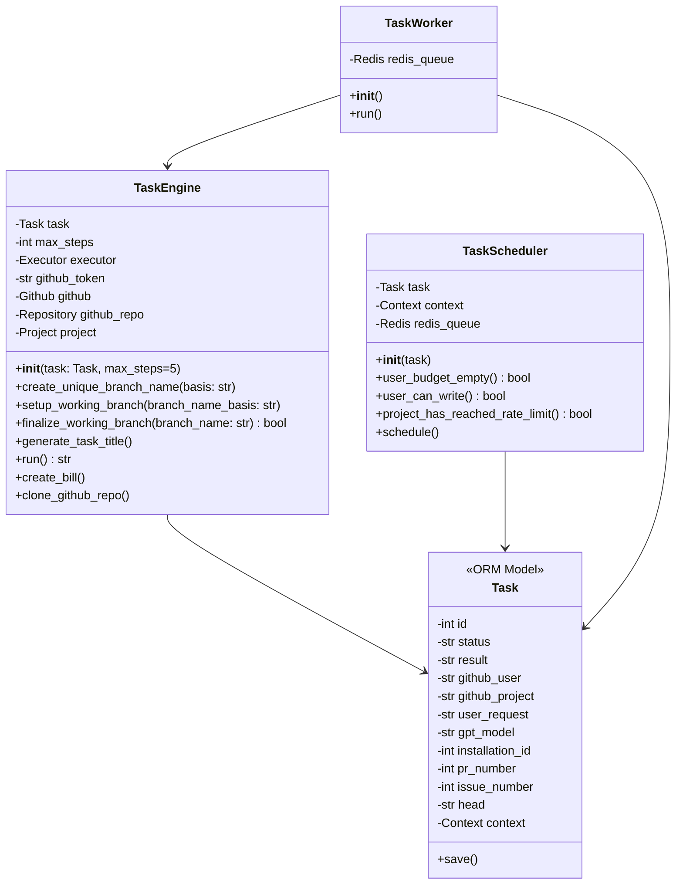
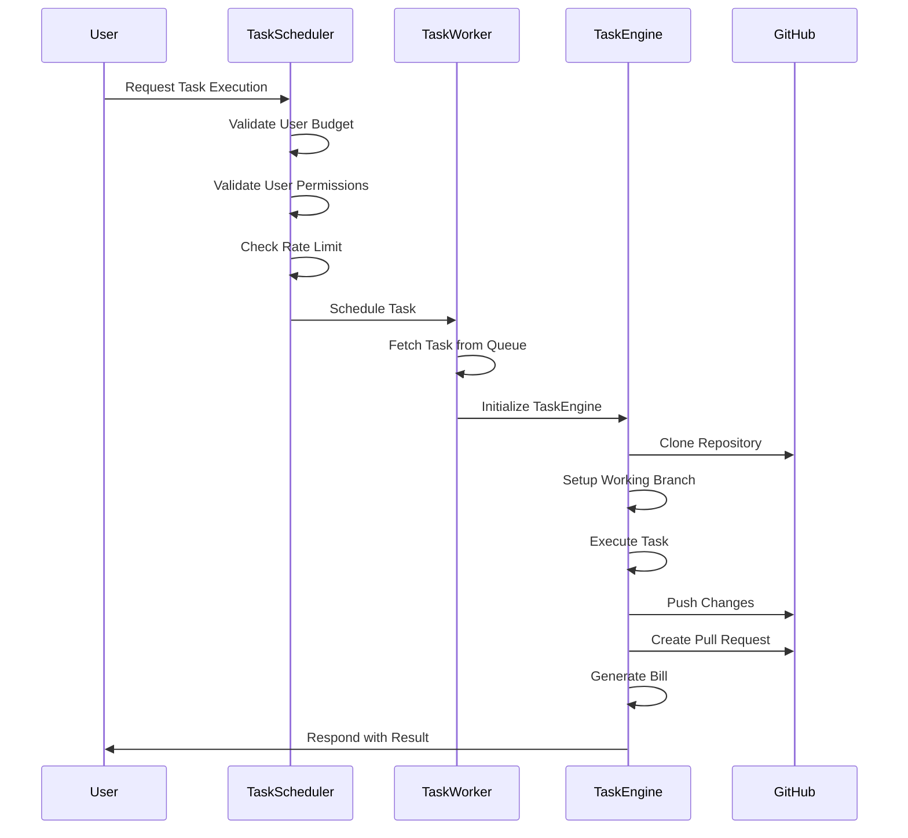

# Task Processing in PR Pilot

The lifecycle of a task within PR Pilot involves several key components: `TaskEngine`, `TaskScheduler`, and `TaskWorker`.

## Domain Model

The task processing in PR Pilot involves three main classes: `TaskEngine`, `TaskScheduler`, and `TaskWorker`.

1. **TaskEngine**: This class is responsible for executing the tasks. It initializes with a `Task` object and sets up the environment for task execution. It handles branch creation, task execution, and finalization, including pushing changes and creating pull requests if necessary. It also manages billing and repository cloning.

2. **TaskScheduler**: This class schedules tasks for execution. It checks the user's budget, permissions, and rate limits before scheduling a task. Depending on the job strategy (thread, Kubernetes, log, or Redis), it schedules the task accordingly.

3. **TaskWorker**: This class continuously listens for tasks in the Redis queue and processes them using the `TaskEngine`. It sets up the necessary environment variables and logging context before running the task.

4. **Task**: This is an ORM model representing a task. It contains various attributes related to the task, such as status, result, GitHub user, project, request, and context. It also provides a method to save the task state.

The `TaskEngine` interacts with the `Task` to perform the actual task execution, while the `TaskScheduler` ensures that tasks are scheduled correctly. The `TaskWorker` listens for tasks and uses the `TaskEngine` to process them.

## Task Lifecycle

1. **User Request**: The user initiates a task execution request.
2. **TaskScheduler**: 
   - Validates the user's budget.
   - Checks if the user has the necessary permissions.
   - Ensures the project has not reached its rate limit.
   - Schedules the task for execution.
3. **TaskWorker**: 
   - Fetches the task from the queue.
   - Initializes the `TaskEngine`.
4. **TaskEngine**: 
   - Clones the GitHub repository.
   - Sets up a working branch.
   - Executes the task using the PR Pilot agent.
   - Pushes any changes to the repository.
   - Creates a pull request if necessary.
   - Generates a bill for the task.
5. **User Response**: The user is informed of the task result, including any pull requests created.
