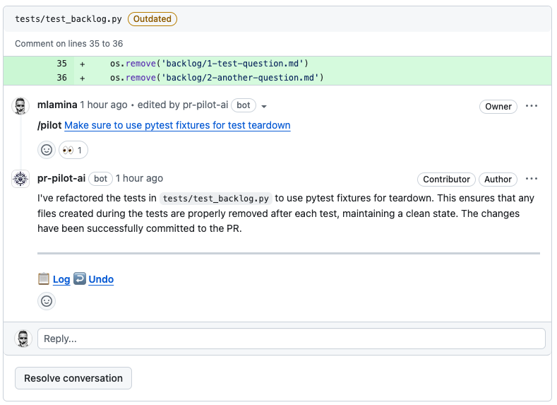
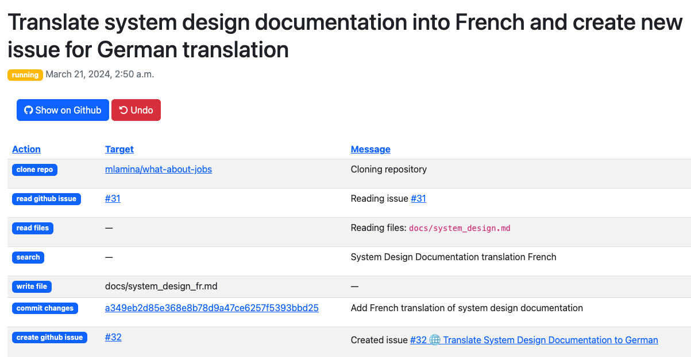

(user_guide)=
# User Guide
PR Pilot is designed for you to save time and to help you stay in the flow. 
The CLI lets you to delegate routine work to AI with confidence and predictability. 

This guide will help you understand how to use PR Pilot in your daily workflow.
## Installation

If you haven't done so, [add PR Pilot](https://github.com/apps/pr-pilot-ai/installations/new) to your repository 
and install the [CLI](https://github.com/PR-Pilot-AI/pr-pilot-cli).

## The Basics

Every interaction between you and PR Pilot is a **task**. Tasks are created using **prompts**.

You and your tools can **interact with PR Pilot using natural language**,
supported by a variety of tools and integrations.
Which one is best for you highly depends on your specific use case. On [YouTube](https://www.youtube.com/watch?v=HVcW3ceqtfw&list=PLDz7ICzRy18wEgi70CPqsaCoNVSEw1GI9) 
and in our [Demo Repo](https://github.com/PR-Pilot-AI/demo), we provide examples of how to use PR Pilot in different scenarios.

PR Pilot will **run tasks autonomously** using its [standard capabilities](capabilities) and
capabilities added via [integrations](integrations).

### You and PR Pilot
Before you get started, there is one key concept to understand:

**PR Pilot runs in its own cloud environment, not your local machine.**

Let's take an example:

```shell
➜  demo git:(main) pilot --verbose --sync task "Edit the README.md file: Add emojis to all headers"

✔ Task created: 78e8b1a8-a7a7-4857-80aa-25db911606b0 (0:00:00.00)
✔ Opened Pull Request: https://github.com/PR-Pilot-AI/demo/pull/33 (0:00:27.56)
╭──────────────────────────────── Result ─────────────────────────────────────────────╮
│ I have added emojis to all headers in the README.md file.                           │
│ The updated content is now more engaging and visually appealing. 🎉                 │
│                                                                                     │
│ If you have any more requests or need further assistance, feel free to ask! 😊      │
╰─────────────────────────────────────────────────────────────────────────────────────╯
✔ Pull latest changes from enhance-readme-md-with (0:00:02.67)

➜  demo git:(enhance-readme-md-with)
```

Here is what happened:
1. You created a task to edit the README.md file.
2. PR Pilot picks up the task and checks out the repository in an isolated environment
3. PR Pilot fulfills your task autonomously (in this case, adding emojis to the README.md file)
4. The file change(s) are pushed to a new branch and a pull request is opened for you to review
5. Because `--sync` was enabled, PR Pilot also checked out the branch for you locally

Now you might say, "but I could do this with Github CoPilot!". 
Here is why this approach is superior:

1. **Clean Repository**: It is good practice to maintain code changes in separate branches. This gives PR Pilot the freedom to make mistakes without cluttering up your code base.
2. **You're in Control**: LLMs make mistakes. We want to make it as easy as possible for you to correct them and not get stuck.
3. **No Context Switching**: You can keep working on this branch and your changes will become part of the new pull request.
4. **Collaboration**: With `--sync` enabled, PR Pilot's next tasks will automatically run on this branch, enabling a collaborative workflow until your code is ready for review.
5. **Agency**: Most importantly, this allows you to use PR Pilot from anywhere - Build pipelines, Github actions, on-prem servers... you name it.

To enable `--sync` by default , run `pilot config edit` and set `auto_sync: true`. 

### Working with Local Files
This approach comes with one drawback: 

**PR Pilot can't access your local files when running a task.**

However, there are a few ways to work around this:

#### Option 1: The `edit` command
You can use the `edit` command to let PR Pilot manipulate a local file for you:

```shell
pilot edit main.py "Make sure all functions and classes have docstrings."
```

This will edit your file **in-place**, instantly.

Under the hood, this sends the local file content to PR Pilot in a special prompt,
which is then run like any other task.

#### Option 2: Prompt templates

[Prompt templates](https://github.com/PR-Pilot-AI/pr-pilot-cli/tree/main/prompts) give you an easy way to
inject shell commands into your prompts, which you can use as a gateway to your local file system:

```markdown
I have an uncommitted file I want you to look at:

{{ sh(['cat', 'new_file.py']) }}
```

This will send the content of `new_file.py` to PR Pilot, where you can process it further.


## Command-Line Interface
Now that you understand the basics, let's dive into the details.
**Tasks always run in the context of a Github repository**:

```bash
➜ pilot task "What's going on"
fatal: not a git repository (or any of the parent directories): .git
No Github repository provided. Use --repo or set 'default_repo' in /Users/mlamina/.pr-pilot.yaml.
```

Either provide the repo manually or `ls` into a repository you have installed PR Pilot, then
use the `pilot` command:

```bash
pilot edit main.py "Make sure all functions and classes have docstrings."
```
This will auto-detect the repository for you.

The CLI is a powerful and flexible tool.
We recommend you take a peak at the [CLI Documentation](https://github.com/PR-Pilot-AI/pr-pilot-cli) to understand 
its possibilities and how it can best serve you. 


### Quick Access to Recent Tasks
The CLI lets you easily go back and see what happens across all your repositories:

```bash
➜  pilot history
                                                                                                                                                                                                                                   
  #   Timestamp       Project                   PR   Status     Title                                                                                                                                                              
  1   5 minutes ago   PR-Pilot-AI/pr-pilot-cli       completed  Compose a Haiku for the Project                                                                                                                                    
  2   5 minutes ago   PR-Pilot-AI/pr-pilot-cli       completed  Compose a Haiku for the Project                                                                                                                                    
  3   6 minutes ago   PR-Pilot-AI/pr-pilot-cli       completed  Compose a Haiku for the Project                                                                                                                                    
  4   6 minutes ago   PR-Pilot-AI/pr-pilot-cli       completed  Compose a Haiku for the Project                                                                                                                                    
  5   8 minutes ago   PR-Pilot-AI/pr-pilot-cli       completed  Compose a Haiku for the Project                                                                                                                                    
  6   25 minutes ago  PR-Pilot-AI/pr-pilot-cli       completed  Automate shell completions setup with subprocess in Python script                                                                                                  
  7   4 hours ago     PR-Pilot-AI/pr-pilot-cli       completed  Integrate Rich Library for Enhanced Output Formatting in Shell Completions Function                                                                                
  8   4 hours ago     PR-Pilot-AI/pr-pilot-cli  #78  completed  Implement 'config' CLI Command Group with 'shell-completions' Command                                                                                              
  9   5 hours ago     PR-Pilot-AI/pr-pilot           completed  Edit PR #170 to Reflect Recent Changes                                                                                                                             
  10  5 hours ago     PR-Pilot-AI/pr-pilot           completed  Generate and Add Relevant Badges to README.md         
```

This gives you easy access to tasks, repositories and PRs you've worked on recently.
Need to look at that prompt your wrote earlier?

```shell
pilot history last <n> prompt --markdown | pbcopy
```

### Personalization and Customization
PR Pilot aims to streamline your workflow by reducing friction and saving you time.

#### Re-Usable Commands
If you find yourself using the same prompts over and over again, you can save them as part of your repository
using the `--save-command` parameter, making this call **re-usable**:

```bash
➜ pilot task -f generate-pr-description.md.jinja2 --save-command

 Save the task parameters as a command:

  Name (e.g. generate-pr-desc): pr-description
  Short description: Generate title and description for a pull request

 Command saved to .pilot-commands.yaml
```

You can now run this command **for any PR** with `pilot run pr-description`:

```bash
➜ pilot run pr-description
Enter value for PR_NUMBER: 83
╭──────────── Result ─────────────╮
│ Here is the link to the PR #83  │
╰─────────────────────────────────╯
```

#### Sharing and Importing Commands

Not only can you re-use this command now, but you can **share** it as well.
**Import commands from any Github** repository using the `grab` command:


```bash
➜  code pilot grab commands pr-pilot-ai/core

       pr-pilot-ai/core
       haiku             Writes a Haiku about your project
       test-analysis     Run unit tests, analyze the output & provide suggestions
       daily-report      Assemble a comprehensive daily report & send it to Slack
       pr-description    Generate PR Title & Description
       house-keeping     Organize & clean up cfg files (package.json, pom.xml, etc)
       readme-badges     Generate badges for your README file

[?] Grab:
   [ ] haiku
   [X] test-analysis
   [ ] daily-report
 > [X] pr-description
   [ ] house-keeping
   [ ] readme-badges


You can now use the following commands:

  pilot run test-analysis   Run unit tests, analyze the output & provide suggestions
  pilot run pr-description  Generate PR Title & Description
```

Our **[core repository](https://github.com/PR-Pilot-AI/core)** contains an ever-growing, curated list of commands
that we tested and handcrafted for you. You can grab them and use them in your own repositories.

#### Give hints for consistent, high-quality results
The quality of the results you get from PR Pilot depends on the quality of the prompts you provide.
Unwanted / wrong / unexpected results can often be avoided by providing the right context.
To make sure you get the best results, you can create a `.pilot-hints.md` file in your repository,
which PR Pilot will read as part of every task.

Here is an example from our PR Pilot CLI repository:

```markdown
- Uses `click` to implement CLI in Python
- Main entry point is the `pilot` command in `cli/cli.py`
- Sub-commands implemented in `cli/commands/` directory
- Uses `poetry` for dependency management
- Uses `rich` for printing to the console
```

Now, **you can use domain-specific language in your prompts**. For example, if you say "Create a new command", PR Pilot knows:
- You're talking about a CLI command
- It should use `click` and `rich` to implement the command in `cli/commands/`
- It should use `poetry` for dependency management

This enables you to **"teach" PR Pilot about your project and your workflow**, making it easier for you to get the results you want.

### Configuration

PR Pilot's configuration is stored in `~/.pr-pilot.yaml`:

```yaml
# Your API Key from https://app.pr-pilot.ai/dashboard/api-keys/
api_key: YOUR_API_KEY

# Default Github repository if not running CLI in a repository directory
default_repo: owner/repo

# Enable --sync by default
auto_sync: true

# Suppress status messages by default
verbose: false
```

Running `pilot config edit` will open the configuration file in your default editor.

## Python SDK

To use PR Pilot in your own tools and integrations, you can use the [Python SDK](https://github.com/PR-Pilot-AI/pr-pilot-python):

```bash
pip install pr-pilot
```

Use the `create_task`, `get_task` and `wait_for_result` functions to automate your Github project:

```python
from pr_pilot.util import create_task, wait_for_result

prompt = """
1. Find all 'bug' issues created yesterday on Slack and Linear.
2. Summarize and post them to #bugs-daily on Slack
3. Save the summary in `reports/<date>.md`
"""

github_repo = "PR-Pilot-AI/pr-pilot"
task = create_task(github_repo, prompt)
result = wait_for_result(task)

print(result)
```

The Python SDK works great for creating [powerful Github Actions](https://github.com/PR-Pilot-AI/smart-actions).


### Using the REST API

The PR Pilot API allows you to trigger tasks using your own tools and integrations.

1. Create a new API Key in the PR Pilot [dashboard](https://app.pr-pilot.ai/dashboard/api-keys/).
2. Use the API Key to authenticate your requests to the [PR Pilot API](https://app.pr-pilot.ai/api/swagger-ui/).

Example:
```bash
curl -X POST 'https://app.pr-pilot.ai/api/tasks/' \
-H 'Content-Type: application/json' \
-H 'X-Api-Key: YOUR_API_KEY_HERE' \
-d '{
    "prompt": "Properly format the README.md and add emojis",
    "github_repo": "owner/repo"
}'
```

### Talk to the Agent in Github Comments

PR Pilot will create issues and PRs for you. To stay in the flow, just use the `/pilot` command followed by a description of the task you want to perform.




The bot will turn your comment into a link to your [dashboard](https://app.pr-pilot.ai), where you can monitor the task's progress.

### Smart Github Actions

If you're comfortable with Github Actions and want to create your own automations, you can use our **[Smart Actions](https://github.com/PR-Pilot-AI/smart-actions)** to create your own workflows.
These actions are hand-crafted using state-of-the-art prompt engineering techniques and let you automate your Github projects in powerful new ways.


## Monitoring Tasks

While a task is running, **PR Pilot** will create events that you can follow in the [dashboard](https://app.pr-pilot.ai/dashboard/tasks/):



You'll also get a detailed overview of how your credits were spent.

